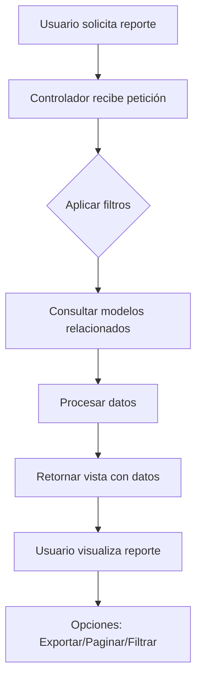

# Plan de Implementación de 12 Reportes de Almacén

## Análisis de Requerimientos y Mapeo de Datos

Basándome en el análisis de la estructura del proyecto, he mapeado cada uno de los 12 reportes con los modelos y relaciones necesarias:

### Reporte 1: Existencia por Insumo
- **Modelos**: Item, Stock, Bodega
- **Columnas**: ID Insumo, Código Insumo, Nombre Insumo, Presentación, Existencia
- **Filtros**: Rango de fecha
- **Estado**: Ya existe parcialmente, necesita mejoras

### Reporte 2: Existencia por Unidad Solicitante
- **Modelos**: Item, Stock, Solicitud, RrhhUnidad
- **Columnas**: ID Insumo, Unidad Solicitante, Código Insumo, Nombre Insumo, Presentación, Existencia
- **Filtros**: Unidad solicitante, Rango de fecha

### Reporte 3: Existencia por Subsecretaría
- **Modelos**: Item, Stock, RrhhUnidad (jerarquía)
- **Columnas**: ID Insumo, Subsecretaría, Unidad Solicitante, Código Insumo, Nombre Insumo, Presentación, Existencia
- **Filtros**: Subsecretaría, Rango de fecha

### Reporte 4: Existencia Periódicas (Semanales y Mensuales)
- **Modelos**: Item, Stock, Kardex
- **Columnas**: ID Insumo, Unidad Solicitante, Código Insumo, Nombre Insumo, Presentación, Existencia
- **Filtros**: Período (semanal/mensual), Fecha específica

### Reporte 5: Ingresos y Egresos Diarios
- **Modelos**: Kardex, Item, Compra, Solicitud
- **Columnas**: ID Operación, Tipo de Movimiento (1-H, REQ), Número de Operación (Folio), Código de Insumo, Presentación, Cantidad, Fecha
- **Filtros**: Rango de fecha

### Reporte 6: 1-H elaborados mensuales
- **Modelos**: Compra1h, Compra, Item
- **Columnas**: ID 1-H, Folio, Fecha de Emisión, Estado (Utilizado o Anulado)
- **Filtros**: Rango de fecha

### Reporte 7: Reporte de Antigüedad de Inventario (Existencias)
- **Modelos**: Item, Stock
- **Columnas**: ID Insumo, Unidad Solicitante, Código Insumo, Nombre Insumo, Presentación, Existencia, Fecha de Ingreso, Días en Bodega (Hoy - Fecha de Ingreso)
- **Filtros**: Rango de fecha

### Reporte 8: Reporte de Movimiento por Tipo
- **Modelos**: Kardex, Item
- **Columnas**: ID Insumo, Subsecretaría, Unidad Solicitante, Tipo de Bodega, Código Insumo, Nombre Insumo, Presentación, Existencia
- **Filtros**: Tipo de movimiento

### Reporte 9: Reporte de Movimientos de Compra por Proveedor
- **Modelos**: Compra, CompraDetalle, Item, Proveedor
- **Columnas**: ID NIT, Nombre del Proveedor, Documento, Código de Insumo, Cantidad
- **Filtros**: Proveedor, Rango de fecha

### Reporte 10: Reporte de Listado de Operaciones por Empleado
- **Modelos**: Kardex, User, Item
- **Columnas**: Dashboard que incluya: Operaciones Asignadas, Operaciones Completadas, Operaciones en Proceso, Operaciones Pendientes, Tiempo Promedio por Operación, Gráfico Principal, Dona
- **Filtros**: Empleado, Rango de fecha

### Reporte 11: Reporte de Registro de Control de Inventario
- **Modelos**: Item, Stock, Kardex
- **Columnas**: ID Insumo, Código Insumo, Nombre Insumo, Presentación, Casilla para que ingresen el inventario físico (este reporte es para realizar la toma física de inventario)
- **Filtros**: Ninguno específico

### Reporte 12: Reporte Movimiento de Salidas por Unidad y Subsecretaría
- **Modelos**: Solicitud, SolicitudDetalle, Item, RrhhUnidad
- **Columnas**: ID Insumo, Subsecretaría, Unidad Solicitante, Código Insumo, Nombre Insumo, Presentación, Existencia
- **Filtros**: Unidad, Subsecretaría, Rango de fecha

## Estructura de Implementación

### 1. Controlador (ReportesAlmacenController)
- Agregar 12 métodos nuevos (uno por reporte)
- Cada método manejará la lógica de consulta y filtros
- Retornará datos para las vistas correspondientes

### 2. Vistas Blade
- Crear 12 vistas nuevas en `resources/views/reportes/`
- Cada vista incluirá:
  - Formularios de filtros
  - Tablas con DataTables
  - Opciones de exportación (PDF, Excel)
  - Diseño responsivo

### 3. Rutas
- Agregar 12 rutas nuevas en `routes/web.php`
- Rutas GET para mostrar reportes
- Rutas POST para filtros y exportaciones

### 4. Assets
- Utilizar DataTables para tablas interactivas
- Incluir filtros de fecha con datepickers
- Implementar gráficos donde sea necesario (reporte 10)

## Diagrama de Flujo General

## Consideraciones Técnicas

1. **Performance**: Implementar paginación y lazy loading para reportes grandes
2. **Filtros**: Crear filtros dinámicos basados en los datos disponibles
3. **Exportación**: Implementar exportación a PDF y Excel
4. **Permisos**: Verificar permisos de usuario para cada reporte
5. **Cache**: Implementar cache para reportes que no cambian frecuentemente
6. **Validación**: Validar todos los parámetros de entrada

## Próximos Pasos

1. Cambiar a modo Code para implementar los métodos del controlador
2. Crear las vistas Blade para cada reporte
3. Agregar las rutas correspondientes
4. Implementar funcionalidades de exportación
5. Probar cada reporte individualmente
6. Optimizar performance según sea necesario